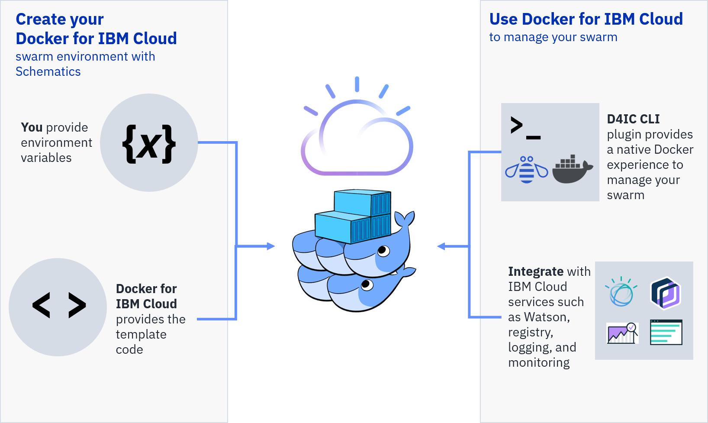

# Docker for IBM Cloud (Demo)

[Docker Enterprise Edition for IBM Cloud](https://store.docker.com/editions/enterprise/docker-ee-aws) uses [IBM Cloud Schematics](https://console.bluemix.net/docs/services/schematics/index.html#gettingstarted) to deploy your Docker swarm infrastructure as code.
<!--Need to update the AWS link to D4IC once we have it!-->

Using this Docker for IBM Cloud template, you can quickly create an environment that simplifies infrastructure reuse and resource deployment in your Docker swarm.

_Overview of Docker for IBM Cloud_

<!--This image is just an idea. The steps for the Watson service binding need to be more concrete.-->

## Creating your swarm environment
With IBM Cloud Schematics, you can create your Docker for IBM Cloud swarm environment by entering the appropriate variables.

Before you begin:
* Make sure you have [IBM Bluemix](https://console.bluemix.net/registration/) and [IBM Bluemix Infrastructure (SoftLayer)](https://control.softlayer.com/) accounts
* Get your IBM Bluemix Infrastructure (SoftLayer) [account API credentials](https://knowledgelayer.softlayer.com/procedure/retrieve-your-api-key)
* If you have not already, [create a space](https://console.bluemix.net/docs/admin/orgs_spaces.html#spaceinfo) in the Bluemix US South region.
<!--Any other prereq's?-->

Create your environment:
1. Select the D4IC template.
2. Give your swarm a name in the **Environment Name** field.
3. Fill out the **Variables** form. The table describes the required variables:
   
    | Name | Description | Default Value |
    | ---- | ----------- | ------------- |
    | softlayer_username | To get your IBM Bluemix Infrastructure (Softlayer) user name, log in to SoftLayer, select your profile, and locate your API Username under the API Access Information section. | |
    | softlayer_api_key | To get your IBM Bluemix Infrastructure (SoftLayer) API key, log in to SoftLayer, select your profile, and locate your Authentication Key under the API Access Information section. | |
    | manager_count | Deploy 1, 3, or 5 manager nodes. | 1 |
    | worker_count | Deploy a minimum of 1 and maximum of 10 worker nodes. | 1 |
    | ssh_key_label | Your IBM Bluemix Infrastructure (SoftLayer) SSH Key for the manager node. To create a key, log in to SoftLayer and select Devices > Manager > SSH Keys > Add. | |
    | datacenter | The location (data center) in the US South region you deploy the swarm to: dal10 or dal12. | |
    | name | The name for your swarm and prefix for the names of each node. | d4ic |
    
4. Click **Create**.
